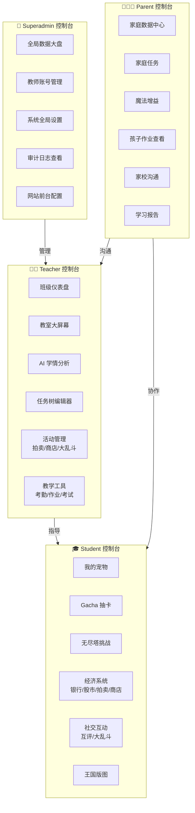

# 🚀 Think-Class：现象级教育游戏化 SaaS 平台

<p align="center">
  
  
  
  
  
  
</p>

<p align="center">
  <strong>将传统课堂转变为沉浸式 RPG 游戏世界 🎮✨</strong>
</p>

---

## 📖 项目简介

**Think-Class** 是一款现象级的 **教育游戏化 SaaS 平台**，旨在通过 **RPG 游戏机制** 和 **赛博魔法风格 UI** 彻底重塑 K12 教育体验。

### 🎯 核心价值主张

- **解决痛点**: 传统教学模式枯燥乏味、学生参与度低、家校沟通不畅
- **目标用户**: 教师（👨‍🏫）、学生（🎓）、家长（👨‍👩‍👧）、管理员（👑）
- **差异化优势**:
  - ✅ **四大权限体系** - 原生支持 Superadmin / Teacher / Student / Parent 四种独立控制台
  - ✅ **20+ 游戏化模块** - 从宠物养成到无尽塔挑战，从拍卖行到王国建设
  - ✅ **全栈 TypeScript** - 前后端统一类型安全，开发体验极致流畅
  - ✅ **双轨打包机制** - 源码包用于开源协同，部署包用于生产环境（详见下方）

### 💡 设计理念

> *"当学习变成一场冒险，每个孩子都是自己故事的主角。"*

Think-Class 将积分系统、成就解锁、宠物养成、团队协作等 RPG 元素深度融入教学场景，让学生在 **"打怪升级"** 中完成知识内化，让教师在 **"游戏主控台"** 中精准掌握学情，让家长在 **"魔法增益系统"** 中参与孩子的成长旅程。

---

## ✨ 核心特性展示

### 🎮 游戏化学习系统

| 功能 | 描述 | 技术亮点 |
|------|------|---------|
| 🏆 积分打卡与成就 | 完成任务获得积分，自动解锁荣誉徽章 | 3D 成就展示柜 + Canvas Confetti 庆祝特效 |
| 🐾 宠物养成与进化 | N~SSR 稀有度图鉴，单抽/十连抽 Gacha 系统 | 极致光影特效 + 多宠物编队管理 |
| ⚔️ 深渊无尽塔 (Dungeon) | 暗黑主题逐层挑战，三种随机房门（战斗/祭坛/宝箱） | Roguelike 机制 + HP 代价与遗物 Buff 策略抉择 |
| 🌳 多维任务树 (Task Tree) | RPG 科技树，完成前置节点解锁下一阶段 | 教师端可视化画布连线编辑器 |

### 💰 经济系统

| 功能 | 描述 | 技术亮点 |
|------|------|---------|
| 🏦 虚拟银行 | 存款生息，培养财商思维 | 复利计算引擎 + 存取款记录 |
| 📈 模拟股市 | 历史趋势 K 线图（Sparkline），低买高卖交易 | Sparklines 可视化 + 实时价格波动 |
| 🎪 拍卖行 (Auction) | 盲拍与竞拍双模式，自动退款机制 | 倒计时逻辑 + 出价被超自动退款 |
| 🛒 商店兑换 | 积分兑换实物或虚拟奖励 | 动态商品库存 + 兑换记录追踪 |

### 👥 社交互动

| 功能 | 描述 | 技术亮点 |
|------|------|---------|
| 💬 学生互评 (Peer Review) | 匿名表扬树洞，积分流转机制 | 隐私保护 + 通知推送系统 |
| 🎆 实时弹幕 (Danmaku) | 全局弹幕 Overlay，学生发弹幕大屏实时飘动 | Short-Polling 高效轮询 + 无拦截渲染 |
| ⚔️ 跨班大乱斗 (Brawl) | 红蓝阵营格斗游戏 UI，积分化作战斗力 | 进度条拉锯战动画 + 跨班级匹配 |
| ✨ 家长魔法增益 (Parent Buff) | 家长发动特权，学生获 20% 全局积分加成 | 金色光环渲染 + 时效性增益管理 |

### 🏰 王国建设 (Territory SLG)

| 功能 | 描述 | 技术亮点 |
|------|------|---------|
| 🗺️ 2D 等距网格大地图 | 可拖拽的 SLG 版图，全班合力捐献积分解锁地形 | @dnd-kit 拖拽库 + 等距投影渲染 |
| 🌲 地形类型系统 | 森林（产木材）、矿区（产金币）等资源点 | 地形产出规则引擎 + 资源统计面板 |
| 👥 协作解锁机制 | 全班共同捐献积分，逐步扩展王国版图 | 实时进度同步 + 解锁动画效果 |

### 📊 数据分析

| 功能 | 描述 | 技术亮点 |
|------|------|---------|
| 🎯 AI 学情雷达 (AI Radar) | 赛博雷达扫描动画，多维度结构化诊断教师分析面板 | 雷达图可视化 + 多指标加权算法 |
| 📊 教师分析面板 | 学生数据汇总、趋势图表、异常检测 | ECharts 图表库 + 数据导出功能 |
| 📋 家长报告系统 | 学习报告生成、成长轨迹可视化 | PDF 导出 + 定期自动推送 |

### 🎨 沉浸式体验

| 功能 | 描述 | 技术亮点 |
|------|------|---------|
| 🪟 玻璃拟态 UI (Glassmorphism) | 半透明背景 + 模糊效果，现代感十足 | Tailwind backdrop-blur + 半透明层叠 |
| ⚡ Framer Motion 动画 | 物理弹簧动力学，丝滑的过渡与交互 | 弹簧物理模型 + 手势识别支持 |
| 🎊 视觉反馈系统 | 操作成功时触发彩带庆祝特效 | canvas-confetti 自定义粒子系统 |
| 🖥️ 教室投影大屏 (Bigscreen) | 星空背景 + 全屏专注倒计时 + 世界 BOSS 血条 | 全屏适配 + 投影模式优化 |

---

## 🖼️ 应用截图

> 📸 *截图正在准备中，以下为各端功能描述占位...*

| 🎓 学生端 | 👨‍🏫 教师端 | 👨‍👩‍👧 家长端 |
|:--------:|:--------:|:--------:|
| 宠物养成界面 | 班级仪表盘 | 家庭增益面板 |
| 无尽塔挑战 | 大屏控制台 | 学习报告查看 |
| 商店兑换 | 任务树编辑器 | 请假申请 |

| 👑 管理员端 | 🖥️ 大屏模式 | 🎪 拍卖行 |
|:--------:|:--------:|:--------:|
| 全局数据大盘 | 世界 Boss 战斗 | 实时竞价列表 |
| 教师管理 | 倒计时器 | 我的出价记录 |

---

## 🏗️ 技术栈

### 前端技术 (Frontend)

<p align="center">
  
  
  
  
</p>

| 技术 | 版本 | 用途 |
|------|------|------|
| ⚛️ React | 18.3 | UI 框架（函数式组件 + Hooks） |
| 🔷 TypeScript | ~5.8 | 类型安全（严格模式） |
| ⚡ Vite | 6.3 | 构建工具（极速 HMR） |
| 🎨 Tailwind CSS | 3.4 | 原子化 CSS 框架 |
| 🎭 Framer Motion | 12.38 | 物理弹簧动画库 |
| 🐻 Zustand | 5.0 | 轻量状态管理 |
| 🔥 Lucide React | 0.511 | 现代 SVG 图标库 |
| 🎊 canvas-confetti | 1.9 | 庆祝彩带特效 |
| 🎯 @dnd-kit | 6.3+ | 拖拽功能（任务树/版图） |
| 🛣️ React Router | 7.3 | 客户端路由管理 |

### 后端技术 (Backend)

<p align="center">
  
  
</p>

| 技术 | 版本 | 用途 |
|------|------|------|
| 🚀 Express | 4.21 | Web 服务框架 |
| 🔷 TypeScript | - | 类型安全的 API 开发 |
| 🗄️ better-sqlite3 | 12.8 | 同步 SQLite 数据库驱动 |
| 🌐 CORS | 2.8 | 跨域资源共享 |
| 📤 Multer | 2.1 | 文件上传中间件 |
| 🔐 自定义认证 | - | 基于 Token 的身份验证 |

### 部署与工具 (DevOps)

| 工具 | 用途 |
|------|------|
| 🔄 PM2 | Node.js 进程守护与集群管理 |
| 📦 Vercel | 一键前端部署（可选） |
| ☁️ 云服务器 | 阿里云 / 腾讯云 / AWS 生产部署 |
| 🔄 Nginx | 反向代理与负载均衡 |
| 📝 ESLint | 代码质量检查 |
| 🔧 Nodemon | 开发时热重载 |

---

## 📦 双轨打包标准指南 (Dual Packaging Guide)

> ⭐ **这是本项目的核心差异化特性！**

为了满足 **"开源协同开发"** 与 **"线上服务器生产"** 两种截然不同的场景需求，本项目采用了严格的 **双轨打包机制**，分别输出两个用途完全不同的压缩包：

### 📁 方案 A：GitHub 纯净源码包 (`Git_Bing.zip`)

**核心用途**: 专为上传至 GitHub 开源、代码备份或提供给其他开发者进行二次开发而设计。

#### ✅ 包含内容

- 完整的前后端业务源代码（`src/`, `api/`）
- 所有的开发依赖配置（`package.json`, `vite.config.ts`, `tsconfig.json` 等）
- 测试文件与文档
- 公共资源文件（`public/`）

#### ❌ 剔除内容

- 本地已安装的庞大依赖包（`node_modules/`）
- 前端编译后的静态产物（`dist/`）
- Git 版本历史（`.git/`）
- AI 生成的缓存与过程文档（`.trae/`）
- 已生成的 ZIP 文件本身（`*.zip`）

#### 📝 生成命令

```bash
zip -r Git_Bing.zip . -x "node_modules/*" -x ".git/*" -x "dist/*" -x ".trae/*" -x "*.zip"
```

#### 💡 使用场景

```bash
# 场景 1: 上传至 GitHub
git add Git_Bing.zip  # 或直接 push 整个仓库

# 场景 2: 分享给其他开发者
# 协作者拉取后需执行:
npm install           # 重新安装依赖
npm run dev           # 启动开发环境
```

---

### 🚀 方案 B：生产环境部署包 (`think-class-release.zip`)

**核心用途**: 专为一键上传至云服务器（阿里云、腾讯云、AWS）进行线上生产环境部署而设计。

#### ✅ 包含内容

- Vite 压缩、混淆和优化后的前端静态网页产物（`dist/`）
- 后端接口代码（`api/`）
- 基础依赖配置（`package.json`, `package-lock.json`）
- PM2 进程守护启动配置（`ecosystem.config.cjs`）
- 部署脚本（`deploy.sh`, `update.sh`, `DEPLOYMENT.md`）

#### ❌ 剔除内容

- **所有前端源码文件**（`src/`, `public/` 等）
- **开发工具配置**（`vite.config.ts`, `nodemon.json` 等）

#### 💡 双重优势

1. **极大缩减传输体积**: 仅包含编译产物，体积缩小 60%-80%
2. **保护源码安全**: 即使服务器被攻破，黑客也无法获取 React 源代码

#### 📝 生成命令

```bash
bash pack.sh
```

#### 🔍 打包流程解析 ([pack.sh](./pack.sh))

```bash
#!/bin/bash
set -e

# [1/4] 编译前端代码 (Vite Build)
npm run build

# [2/4] 整理打包文件目录
rm -rf release_build
mkdir -p release_build

# 拷贝核心产物（仅包含运行必需文件）
cp -r dist release_build/          # 前端编译产物
cp -r api release_build/            # 后端 API
cp package.json release_build/
cp package-lock.json release_build/
cp tsconfig.json release_build/

# 拷贝部署配置（从 .tmp/deploy/ 提取）
cp .tmp/deploy/ecosystem.config.cjs release_build/
cp .tmp/deploy/deploy.sh release_build/
cp .tmp/deploy/update.sh release_build/
cp .tmp/deploy/DEPLOYMENT.md release_build/

# [3/4] 压缩生成 zip 文件
cd release_build
zip -r -q ../think-class-release.zip .

# [4/4] 清理临时文件
rm -rf release_build

echo "✅ 生成文件: think-class-release.zip"
```

---

### 📊 两种方案对比总览

| 特性维度 | 📁 Git_Bing.zip（源码包） | 🚀 think-class-release.zip（部署包） |
|:--------:|:------------------------:|:----------------------------------:|
| **核心用途** | 开源 / 二次开发 / 代码备份 | 生产环境一键部署 |
| **包含源码** | ✅ 完整前后端源代码 | ❌ 仅编译后产物 |
| **包含依赖** | ❌ 需协作者自行 `npm install` | ✅ 含 `package-lock.json` |
| **文件大小** | 较大（含源码 + 配置） | 极小（仅运行必需文件） |
| **适用场景** | GitHub 上传、代码分享、学习研究 | 服务器部署、快速上线、客户交付 |
| **安全性** | 低（暴露全部源码逻辑） | 高（保护商业逻辑） |
| **目标用户** | 开发者、贡献者、学习者 | 运维人员、客户、最终用户 |
| **生成方式** | 手动 `zip` 命令 | 自动化脚本 `bash pack.sh` |
| **后续操作** | `npm install && npm run dev` | `npm install --production && pm2 start` |

---

## 🚀 快速开始 (Quick Start)

### 📋 环境要求

- **Node.js** >= 18.x（推荐 LTS 版本）
- **npm** >= 9.x 或 **pnpm** >= 8.x 或 **yarn** >= 1.22
- **Git** >= 2.x
- **操作系统**: Windows / macOS / Linux

### 📦 安装步骤

#### 1️⃣ 克隆仓库

```bash
git clone https://github.com/xhnhhnh/Think-Claass.git
cd Think-Claass
```

#### 2️⃣ 安装依赖

```bash
# 使用 npm（推荐）
npm install

# 或使用 pnpm（更快）
pnpm install

# 或使用 yarn
yarn install
```

#### 3️⃣ 初始化数据库

```bash
# 方式 A: 直接运行初始化脚本
npx tsx init_db.ts

# 方式 B: 如果 package.json 中配置了 init-db 脚本
npm run init-db
```

> 💡 **提示**: 数据库文件将创建在项目根目录下的 `database.sqlite`

#### 4️⃣ 启动开发服务器

```bash
# 同时启动前端 + 后端（推荐）
npm run dev
```

启动成功后，你可以在浏览器中访问：

- **前端应用**: http://localhost:5173
- **后端 API**: http://localhost:3001/api

#### 🎉 恭喜！

现在你已经成功运行了 Think-Class！可以开始探索四大权限控制台的强大功能了！

---

### 🛠️ 其他可用脚本

```bash
# ==================== 开发模式 ====================

# 仅启动前端开发服务器（Vite HMR）
npm run client:dev
# 访问: http://localhost:5173

# 仅启动后端开发服务器（Nodemon 热重载）
npm run server:dev
# 访问: http://localhost:3001

# 同时启动前后端（推荐开发时使用）
npm run dev

# ==================== 构建与检查 ====================

# 生产构建（TypeScript 编译 + Vite 打包）
npm run build
# 输出目录: dist/

# TypeScript 类型检查（不生成文件）
npm run check

# ESLint 代码质量检查
npm run lint

# 预览生产构建结果
npm run preview
# 访问: http://localhost:4173

# ==================== 部署相关 ====================

# 生成生产部署包
bash pack.sh
# 输出: think-class-release.zip
```

---

## 📂 项目结构 (Project Structure)

```
Think-Claass/
│
├── 📁 api/                          # 🔧 后端 API 服务（Express + TypeScript）
│   ├── 📁 routes/                   # 🛣️ API 路由模块（30+ 个业务模块）
│   │   ├── admin.ts                # 👑 管理员接口（全局设置、教师管理）
│   │   ├── auth.ts                 # 🔐 认证接口（登录、注册、Token）
│   │   ├── student.ts              # 🎓 学生接口（积分、等级、数据）
│   │   ├── teacher.ts              # 👨‍🏫 教师接口（班级管理、活动控制）
│   │   ├── gacha.ts                # 🎰 抽卡系统接口（单抽/十连抽）
│   │   ├── dungeon.ts              # ⚔️ 无尽塔接口（层数、战斗、遗物）
│   │   ├── slg.ts                  # 🗺️ 王国版图接口（地形、资源）
│   │   ├── economy.ts              # 💰 经济系统接口（银行、股市）
│   │   ├── battles.ts              # ⚔️ 大乱斗接口（阵营对战）
│   │   ├── danmaku.ts              # 💬 弹幕接口（发送、拉取）
│   │   ├── taskTree.ts             # 🌳 任务树接口（节点、连线）
│   │   ├── parentBuff.ts           # ✨ 家长增益接口（激活、时效）
│   │   ├── peerReviews.ts          # 💬 互评接口（匿名表扬）
│   │   ├── auction.ts              # 🎪 拍卖行接口（出价、成交）
│   │   ├── pet.ts                  # 🐾 宠物接口（养成、进化）
│   │   ├── shop.ts                 # 🛒 商店接口（商品、兑换）
│   │   ├── announcements.ts        # 📢 公告接口（全局通知）
│   │   ├── messages.ts             # 💌 消息接口（站内信）
│   │   ├── certificates.ts         # 🏆 证书接口（荣誉证书）
│   │   ├── challenge.ts            # 🎯 挑战接口（每日任务）
│   │   ├── attendance.ts           # 📋 考勤接口（签到、请假）
│   │   ├── assignments.ts          # 📝 作业接口（发布、批改）
│   │   ├── exams.ts                # 📄 考试接口（成绩管理）
│   │   ├── familyTasks.ts          # 👨‍👩‍👧 家庭任务接口（亲子互动）
│   │   ├── teamQuests.ts           # 👥 团队任务接口（协作挑战）
│   │   ├── lucky_draw.ts           # 🎲 幸运抽奖接口
│   │   ├── redemption.ts           # 🎁 兑换记录接口
│   │   ├── groups.ts               # 👥 分组接口（小组管理）
│   │   ├── praises.ts              # 👏 表扬接口（教师点赞）
│   │   ├── presets.ts              # ⚙️ 预设接口（模板配置）
│   │   ├── settings.ts             # ⚙️ 系统设置接口
│   │   ├── system.ts               # 🔧 系统维护接口
│   │   ├── website.ts              # 🌐 网站配置接口
│   │   ├── openapi.ts              # 📖 OpenAPI 文档接口
│   │   ├── auditLogs.ts            # 📋 审计日志接口
│   │   ├── leaves.ts               # ✈️ 请假接口
│   │   └── classAnnouncements.ts   # 📢 班级公告接口
│   │
│   ├── 📁 utils/                   # 🔧 工具函数库
│   │   ├── asyncHandler.ts         # 异步错误处理包装器
│   │   ├── errorHandler.ts         # 统一错误响应格式
│   │   ├── logMiddleware.ts        # 请求日志中间件
│   │   └── logger.ts               # 日志记录器（Winston/Pino）
│   │
│   ├── app.ts                      # 🚀 Express 应用实例配置
│   ├── db.ts                       # 🗄️ SQLite 数据库连接与初始化
│   ├── index.ts                    # 📦 API 入口导出
│   └── server.ts                   # 🌐 HTTP 服务器启动入口
│
├── 📁 src/                          # ⚛️ 前端 React 应用（TypeScript + Vite）
│   │
│   ├── 📁 components/              # 🧩 公共可复用组件
│   │   ├── 📁 Layout/              # 📐 四大权限布局组件
│   │   │   ├── AdminLayout.tsx     # 👑 管理员布局（侧边栏 + 顶栏）
│   │   │   ├── TeacherLayout.tsx   # 👨‍🏫 教师布局（班级导航 + 工具栏）
│   │   │   ├── StudentLayout.tsx   # 🎓 学生布局（游戏化导航）
│   │   │   └── ParentLayout.tsx    # 👨‍👩‍👧 家长布局（家庭中心）
│   │   ├── DanmakuOverlay.tsx      # 💬 全局弹幕 Overlay 组件
│   │   ├── ThemeWrapper.tsx        # 🎨 主题包装器（暗色/亮色切换）
│   │   ├── AnnouncementBanner.tsx  # 📢 公告横幅组件
│   │   └── Empty.tsx               # 📭 空状态占位组件
│   │
│   ├── 📁 pages/                   # 📄 页面组件（按角色分组）
│   │   │
│   │   ├── 📁 Admin/               # 👑 管理员页面（10+ 个）
│   │   │   ├── Dashboard.tsx       # 📊 全局数据大盘
│   │   │   ├── Login.tsx           # 🔐 管理员登录页
│   │   │   ├── Settings.tsx        # ⚙️ 系统全局设置
│   │   │   ├── Teachers.tsx        # 👨‍🏫 教师账号管理
│   │   │   ├── Announcements.tsx   # 📢 全局公告发布
│   │   │   ├── Articles.tsx        # 📝 文章/资讯管理
│   │   │   ├── AuditLogs.tsx       # 📋 操作审计日志
│   │   │   ├── Codes.tsx           # 🎫 邀请码管理
│   │   │   ├── Website.tsx         # 🌐 网站前台配置
│   │   │   └── OpenApi.tsx         # 📖 API 文档页面
│   │   │
│   │   ├── 📁 Teacher/             # 👨‍🏫 教师页面（25+ 个）
│   │   │   ├── Dashboard.tsx       # 📊 班级数据仪表盘
│   │   │   ├── Bigscreen.tsx       # 🖥️ 教室投影大屏
│   │   │   ├── Analysis.tsx        # 🎯 AI 学情雷达分析
│   │   │   ├── Attendance.tsx      # 📋 考勤管理
│   │   │   ├── Assignments.tsx     # 📝 作业发布与批改
│   │   │   ├── Exams.tsx           # 📄 考试成绩管理
│   │   │   ├── TaskTree.tsx        # 🌳 任务树可视化编辑器
│   │   │   ├── Shop.tsx            # 🛒 商店商品配置
│   │   │   ├── Auction.tsx         # 🎪 拍卖行管理
│   │   │   ├── Pets.tsx            # 🐾 宠物系统配置
│   │   │   ├── Brawl.tsx           # ⚔️ 大乱斗发起与监控
│   │   │   ├── Territory.tsx       # 🗺️ 王国版图管理
│   │   │   ├── WorldBoss.tsx       # 👹 世界 Boss 战斗
│   │   │   ├── LuckyDrawConfig.tsx # 🎲 幸运抽奖配置
│   │   │   ├── BlindBox.tsx        # 📦 盲盒系统
│   │   │   ├── Certificates.tsx    # 🏆 证书颁发管理
│   │   │   ├── Communication.tsx   # 💬 家校沟通
│   │   │   ├── Settings.tsx        # ⚙️ 班级个性化设置
│   │   │   ├── Records.tsx         # 📜 历史记录查询
│   │   │   ├── Features.tsx        # ✨ 功能开关
│   │   │   ├── Tools.tsx           # 🔧 教学工具箱
│   │   │   ├── Verification.tsx    # ✅ 学生审核
│   │   │   ├── TeamQuests.tsx      # 👥 团队任务管理
│   │   │   ├── AddStudent.tsx      # ➕ 添加学生
│   │   │   └── components/         # 🧩 教师端专用组件
│   │   │       ├── ClassroomTools.tsx
│   │   │       ├── DraggableStudent.tsx
│   │   │       └── DroppableGroup.tsx
│   │   │
│   │   ├── 📁 Student/             # 🎓 学生页面（20+ 个）
│   │   │   ├── Achievements.tsx    # 🏆 成就墙展示
│   │   │   ├── Pet.tsx             # 🐾 我的宠物
│   │   │   ├── Gacha.tsx           # 🎰 抽卡界面
│   │   │   ├── Dungeon.tsx         # ⚔️ 无尽塔挑战
│   │   │   ├── Bank.tsx            # 🏦 虚拟银行
│   │   │   ├── Auction.tsx         # 🎪 拍卖行
│   │   │   ├── Shop.tsx            # 🛒 积分商店
│   │   │   ├── TaskTree.tsx        # 🌳 我的任务树
│   │   │   ├── Brawl.tsx           # ⚔️ 大乱斗战场
│   │   │   ├── Territory.tsx       # 🗺️ 王国版图
│   │   │   ├── PeerReview.tsx      # 💬 互评树洞
│   │   │   ├── InteractiveWall.tsx # 🧱 互动墙
│   │   │   ├── LuckyDraw.tsx       # 🎲 幸运抽奖
│   │   │   ├── Challenge.tsx       # 🎯 每日挑战
│   │   │   ├── Certificates.tsx    # 🏆 我的证书
│   │   │   ├── Assignments.tsx     # 📝 我的作业
│   │   │   ├── MyRedemptions.tsx   # 🎁 兑换记录
│   │   │   ├── GuildPK.tsx         # ⚔️ 公会 PK
│   │   │   └── TeamQuests.tsx      # 👥 团队任务
│   │   │
│   │   ├── 📁 Parent/              # 👨‍👩‍👧 家长页面（6+ 个）
│   │   │   ├── Dashboard.tsx       # 📊 家庭数据中心
│   │   │   ├── Tasks.tsx           # 📋 家庭任务
│   │   │   ├── Buff增益.tsx        # ✨ 魔法增益激活
│   │   │   ├── Assignments.tsx     # 📝 孩子作业查看
│   │   │   ├── LeaveRequest.tsx    # ✈️ 请假申请
│   │   │   ├── Communication.tsx   # 💬 家校沟通
│   │   │   └── Report.tsx          # 📋 学习报告
│   │   │
│   │   └── 📁 Home/                # 🏠 公共首页
│   │       ├── Home.tsx            # 🏠 首页主页
│   │       ├── About.tsx           # ℹ️ 关于我们
│   │       ├── Services.tsx        # ✨ 服务介绍
│   │       ├── News.tsx            # 📰 新闻动态
│   │       └── Contact.tsx         # 📞 联系我们
│   │
│   ├── 📁 hooks/                   # 🪝 自定义 React Hooks
│   │   └── useTheme.ts             # 🎨 主题切换 Hook
│   │
│   ├── 📁 lib/                     # 📚 工具库
│   │   ├── api.ts                  # 🌐 API 请求封装（Axios/Fetch）
│   │   └── utils.ts                # 🔧 通用工具函数
│   │
│   ├── 📁 store/                   # 🐻 状态管理（Zustand）
│   │   └── useStore.ts             # 📦 全局状态 Store
│   │
│   ├── App.tsx                     # 🚀 根组件（路由配置）
│   ├── main.tsx                    # 📍 应用入口文件
│   ├── index.css                   # 🎨 全局样式（Tailwind 导入）
│   └── vite-env.d.ts              # 📝 Vite 类型声明
│
├── 📁 public/                       # 📦 静态资源文件
│   └── favicon.svg                 # 🎨 网站图标
│
├── 📄 配置文件
│   ├── package.json                # 📦 项目依赖与脚本
│   ├── vite.config.ts              # ⚡ Vite 构建配置
│   ├── tailwind.config.js          # 🎨 Tailwind CSS 配置
│   ├── tsconfig.json               # 🔷 TypeScript 编译选项
│   ├── eslint.config.js            # 🔍 ESLint 代码规范
│   ├── postcss.config.js           # 📝 PostCSS 配置
│   ├── nodemon.json                # 🔄 Nodemon 监听配置
│   ├── ecosystem.config.cjs        # 🔄 PM2 进程管理配置
│   └── vercel.json                 # 📦 Vercel 部署配置
│
├── 📜 脚本文件
│   ├── pack.sh                     # 📦 生产部署包生成脚本
│   ├── install.sh                  # 📥 服务器环境初始化脚本
│   ├── update.sh                   # 🔄 服务器更新脚本
│   ├── init_db.ts                  # 🗄️ 数据库初始化脚本
│   ├── update_db.ts                # 🔄 数据库迁移脚本
│   ├── create_placeholders.sh      # 📝 占位符生成脚本
│   ├── replace_styles.cjs          # 🎨 样式替换脚本
│   └── update_layouts.cjs          # 📐 布局更新脚本
│
├── 📄 数据文件
│   ├── database.sqlite             # 🗄️ SQLite 数据库文件
│   ├── database.sqlite-shm         # 🗄️ SQLite 共享内存文件
│   └── database.sqlite-wal         # 🗄️ SQLite WAL 日志文件
│
├── 📁 .tmp/                        # 📂 临时构建目录（.gitignore）
│   ├── 📁 deploy/                  # 🚀 部署包临时文件
│   └── 📁 update/                  # 🔄 更新包临时文件
│
├── 📄 .gitignore                   # 🚫 Git 忽略规则
├── 📄 index.html                   # 🌐 HTML 入口文件
└── 📄 README.md                    # 📖 项目文档（本文件）
```

---

## 🎯 四大权限体系 (Role-Based Access Control)

Think-Class 通过一套底层数据模型，原生且独立地支持 **四种角色** 的控制台，每种角色拥有专属的功能模块和视觉风格：

| 角色 | 图标 | 核心定位 | 主要功能模块 | 典型使用场景 |
|:----:|:----:|---------|-------------|------------|
| **Superadmin** | 👑 | 平台管理者 | 全局大盘、系统设置、教师管理、审计日志、网站配置 | 查看全校数据、管理教师账号、调整系统参数 |
| **Teacher** | 👨‍🏫 | 班级主控者 | 仪表盘、大屏幕、学情分析、任务树编辑、拍卖/商店配置、考勤、作业、考试 | 课堂教学管理、发起大乱斗、查看学生数据、配置游戏化规则 |
| **Student** | 🎓 | 游戏化学习者 | 宠物养成、抽卡、无尽塔、银行、股市、拍卖、商店、任务树、互评、大乱斗、版图、成就 | 日常学习打卡、参与游戏化活动、积累积分兑换奖励 |
| **Parent** | 👨‍👩‍👧 | 家校共育者 | 家庭数据中心、家庭任务、魔法增益、作业查看、请假申请、家校沟通、学习报告 | 查看孩子学习情况、发放积分增益、与老师沟通 |

### 🔐 权限隔离设计



---

## 🌐 部署指南 (Deployment)

Think-Class 支持多种部署方式，根据你的需求选择最适合的方案：

---

### ☁️ 方案一：云服务器部署（推荐生产环境）

适用于正式上线运营，需要稳定性和可控性的场景（阿里云、腾讯云、AWS 等）。

#### 📦 步骤 1：生成部署包

在本地开发环境中执行：

```bash
bash pack.sh
```

执行成功后将生成 `think-class-release.zip` 文件。

#### 📤 步骤 2：上传至服务器

```bash
# 使用 SCP 上传（替换为你的服务器信息）
scp think-class-release.zip user@your-server-ip:/home/user/

# 或使用 SFTP 工具（如 FileZilla、WinSCP）图形化上传
```

#### 🔧 步骤 3：服务器环境配置

SSH 登录到你的服务器后执行：

```bash
# 进入上传目录
cd /home/user

# 解压部署包
unzip think-class-release.zip
cd think-class-release

# 安装生产依赖（仅安装 runtime 依赖，跳过 devDependencies）
npm install --production

# 初始化数据库（如果需要）
npx tsx init_db.ts
```

#### 🚀 步骤 4：使用 PM2 启动服务

```bash
# 启动应用（使用 ecosystem.config.cjs 配置）
pm2 start ecosystem.config.cjs

# 保存当前进程列表（防止服务器重启丢失）
pm2 save

# 设置开机自启（生成 startup 脚本）
pm2 startup
# （按照提示执行输出的命令，通常需要 sudo 权限）
```

#### 🌐 步骤 5：配置 Nginx 反向代理（可选但推荐）

创建 Nginx 配置文件 `/etc/nginx/conf.d/think-class.conf`：

```nginx
server {
    listen 80;
    server_name your-domain.com;  # 替换为你的域名或 IP

    # 前端静态文件
    location / {
        root /home/user/think-class-release/dist;
        try_files $uri $uri/ /index.html;
    }

    # API 反向代理
    location /api {
        proxy_pass http://127.0.0.1:3001;
        proxy_http_version 1.1;
        proxy_set_header Upgrade $http_upgrade;
        proxy_set_header Connection 'upgrade';
        proxy_set_header Host $host;
        proxy_set_header X-Real-IP $remote_addr;
        proxy_set_header X-Forwarded-For $proxy_add_x_forwarded_for;
        proxy_cache_bypass $http_upgrade;
    }

    # Gzip 压缩
    gzip on;
    gzip_types text/plain text/css application/json application/javascript text/xml application/xml;
}
```

重启 Nginx 使配置生效：

```bash
sudo nginx -t          # 测试配置语法
sudo systemctl restart nginx
```

#### 🔒 步骤 6：配置 HTTPS（强烈推荐生产环境）

```bash
# 安装 Certbot（Let's Encrypt 客户端）
sudo apt-get install certbot python3-certbot-nginx  # Ubuntu/Debian
# 或 sudo yum install certbot python2-certbot-nginx  # CentOS/RHEL

# 自动获取并配置 SSL 证书
sudo certbot --nginx -d your-domain.com

# Certbot 会自动修改 Nginx 配置并设置自动续期
```

#### 📊 步骤 7：验证部署

访问你的域名或 IP 地址，确认：

- ✅ 前端页面正常加载（应显示登录页或首页）
- ✅ API 接口可正常调用（浏览器开发者工具 Network 面板无报错）
- ✅ 登录功能正常（能成功登录各角色账号）

> 📖 **详细部署文档**: 详见部署包内的 [DEPLOYMENT.md](./.tmp/deploy/DEPLOYMENT.md)

---

### ⚡ 方案二：Vercel 一键部署（适合快速体验/演示）

适用于快速预览、Demo 展示、开发测试等场景。

#### 🚀 一键部署按钮

[](https://vercel.com/new/clone?repository-url=https://github.com/xhnhhnh/Think-Claass)

#### 🛠️ 手动部署步骤

```bash
# 1. 安装 Vercel CLI
npm i -g vercel

# 2. 在项目根目录执行
vercel

# 3. 按照提示操作：
#    - 选择 Link to existing project（链接已有项目）或 Create new
#    - 确认项目名称和组织
#    - 确认构建设置（Vercel 会自动检测 Vite + Express）
#    - 等待部署完成

# 4. 部署成功后，Vercel 会提供一个公开 URL
#    类似: https://think-class-xxx.vercel.app
```

> ⚠️ **注意**: Vercel 部署适用于前端展示，如需完整后端 API 功能，建议使用云服务器部署方案。

---

### 🐳 方案三：Docker 部署（进阶用户）

> 🚧 *Dockerfile 正在准备中，敬请期待...*

```dockerfile
# 未来将提供官方 Docker 镜像
# docker pull ghcr.io/xhnhhnh/think-class:latest
```

---

## 🗺️ 发展历程 (Roadmap & Version History)

Think-Class 历经了 **四个核心阶段（Phases）** 的迭代，从一个基础的积分打卡系统，演变成了一个全方位、多维度的游戏化教育平台：

### ✅ Phase 1 - 沉浸式视觉与互动起步

*奠定游戏化基调，打造视觉冲击力*

- [x] **互评系统 (Peer Review)** - 学生间匿名的表扬树洞，带有积分流转和通知机制
- [x] **成就墙 (Achievements)** - 基于积分与条件自动解锁荣誉徽章的 3D 视觉成就展示柜
- [x] **沉浸大屏 (Bigscreen)** - 专为教室投影打造，拥有星空背景、全屏专注倒计时和世界 BOSS 的巨型实时血条

### ✅ Phase 2 - 经济扩充与高阶数据

*引入经济系统，增强数据分析能力*

- [x] **拍卖行 (Auction House)** - 支持倒计时的盲拍与竞拍机制，具备自动退款（出价被超）的完整交易逻辑
- [x] **家长魔法增益 (Parent Buff)** - 家长端发动的专属特权，能使学生在规定时间内获得 20% 的全局积分收益加成，并在宠物周围渲染出金色光环
- [x] **AI 学情雷达 (AI Radar)** - 以赛博雷达扫描动画的方式，对学生数据进行多维结构化诊断的教师分析面板

### ✅ Phase 3 - 大型多人互动与 RPG 探索

*强化社交属性，引入 RPG 元素*

- [x] **师生实时弹幕 (Real-time Danmaku)** - 利用高效的 Short-Polling，实现无拦截的全局弹幕 Overlay，学生端发弹幕，大屏端实时飘动
- [x] **多维任务树 (Task Tree)** - RPG 游戏的科技/技能树，学生必须完成前置节点才能解锁下一阶段，教师端提供可视化的画布连线编辑器
- [x] **校区跨班大乱斗 (Inter-class Brawl)** - 红蓝阵营的格斗游戏 UI，教师可跨班发起挑战，学生的实时积分化作战力，在屏幕中央形成强烈的进度条拉锯战

### ✅ Phase 4 - 终极史诗更新 (The Mega Update)

*全面爆发，构建完整生态*

- [x] **王国版图 SLG (Territory)** - 可拖拽的 2D 等距网格大地图，全班合力捐献积分解锁不同类型的地形（森林、矿区），产出木材、金币等集体资源
- [x] **宠物进化与抽卡 (Gacha)** - 建立在 N~SSR 稀有度图鉴之上的抽卡系统，带有极致的光影特效，支持单抽与十连抽，并将原有的单宠物升级为了多宠物编队系统
- [x] **经济系统 (Bank & Stocks)** - 不仅有存款生息的虚拟银行，还有带有历史趋势 K 线图（Sparkline）的模拟股市，学生可利用积分体验低买高卖
- [x] **深渊无尽塔 (Roguelike Dungeon)** - 暗黑主题的逐层挑战系统，每层提供三种随机房门（战斗、祭坛、宝箱），学生需要在 HP 代价与积分/遗物 Buff 奖励之间进行生死抉择

---

### 🚧 未来规划 (Future Plans)

*持续进化，无限可能*

- [ ] **移动端响应式适配优化** - 全面适配手机和平板设备
- [ ] **多语言国际化支持 (i18n)** - 支持中文、英文、日文等多语言切换
- [ ] **微信小程序版本** - 推出轻量级小程序，方便移动端使用
- [ ] **AI 智能出题与批改** - 集成 LLM 实现智能题目生成和作业批改
- [ ] **VR/AR 沉浸式课堂** - 结合虚拟现实技术打造元宇宙教室
- [ ] **多租户 SaaS 化** - 支持多学校、多机构独立运营
- [ ] **开放 API 与插件市场** - 允许第三方开发者扩展功能
- [ ] **区块链积分系统** - 积分上链，实现真正的数字资产确权

---

## 🧪 开发指南 (Development Guide)

欢迎所有开发者参与贡献！以下是详细的开发环境搭建指引。

### 🛠️ 本地开发环境搭建

#### 前置条件

确保你的开发环境已安装以下工具：

- **Node.js**: >= 18.x（推荐使用 [nvm](https://github.com/nvm-sh/nvm) 管理）
- **包管理器**: npm / pnpm / yarn（任选其一）
- **Git**: >= 2.x
- **IDE**: 推荐 VS Code（安装以下扩展）：
  - ES7+ React/Redux/React-Native snippets
  - Tailwind CSS IntelliSense
  - TypeScript Importer
  - Prettier - Code formatter

#### 详细步骤

```bash
# ========================================
# 1. Fork 并克隆仓库
# ========================================

# 在 GitHub 上 Fork 本仓库到你的账号
# 然后克隆你 Fork 的仓库（而非原始仓库）
git clone https://github.com/YOUR_USERNAME/Think-Claass.git
cd Think-Claass

# 添加上游仓库（方便后续同步更新）
git remote add upstream https://github.com/xhnhhnh/Think-Claass.git

# ========================================
# 2. 安装依赖
# ========================================

# 使用 npm（标准方式）
npm install

# 或使用 pnpm（更快，节省磁盘空间）
pnpm install

# ========================================
# 3. 初始化数据库
# ========================================

# 创建 SQLite 数据库并初始化表结构
npx tsx init_db.ts

# 验证数据库是否创建成功
ls -la database.sqlite
# 应该能看到 database.sqlite 文件

# ========================================
# 4. 启动开发服务器
# ========================================

# 同时启动前端（端口 5173）和后端（端口 3001）
npm run dev

# 或者分别在两个终端窗口启动：
# 终端 1: npm run client:dev   # 前端
# 终端 2: npm run server:dev   # 后端
```

#### 🎉 验证开发环境

启动成功后，在浏览器中打开以下地址确认：

- **前端**: http://localhost:5173 → 应显示 Think-Class 登录页或首页
- **后端健康检查**: http://localhost:3001/api → 应返回 API 响应（可能是 404 或 JSON 错误，说明服务正常运行）

---

### 📏 代码规范

#### TypeScript 规范

- ✅ 使用 **严格模式**（`strict: true` in `tsconfig.json`）
- ✅ 所有函数必须有明确的 **返回类型注解**
- ✅ 使用 **interface** 定义对象类型，**type** 定义联合类型
- ✅ 避免 **any** 类型，必要时使用 **unknown**
- ✅ 使用 **enum** 或 **const object** 定义常量集合

#### React 组件规范

- ✅ 组件采用 **函数式组件 + Hooks**（禁止 Class 组件）
- ✅ 单个文件只导出一个 **默认组件**
- ✅ 组件名使用 **PascalCase**，文件名与组件名一致
- ✅ Props 接口以 **ComponentNameProps** 命名
- ✅ 使用 **解构赋值** 获取 Props
- ✅ 自定义 Hook 以 **use** 开头（如 `useTheme`, `useAuth`）

#### 样式规范

- ✅ 优先使用 **Tailwind CSS** 原子类
- ✅ 复杂样式使用 **@apply** 指令或 **arbitrary values** `[...]`
- ✅ 避免内联样式（除非动态计算值）
- ✅ 响应式设计使用 Tailwind 断点前缀（`sm:`, `md:`, `lg:`, `xl:`）

#### Git 提交规范

遵循 [Conventional Commits](https://www.conventionalcommits.org/) 规范：

```
<type>(<scope>): <subject>

<body>

<footer>
```

**Type 类型**:

| Type | 描述 | 示例 |
|------|------|------|
| `feat` | 新功能 | `feat(gacha): 添加十连抽功能` |
| `fix` | Bug 修复 | `fix(dungeon): 修复第 10 层无法进入的问题` |
| `docs` | 文档更新 | `docs(readme): 补充部署说明` |
| `style` | 代码格式调整（不影响功能） | `style(teacher): 统一导入顺序` |
| `refactor` | 重构（非新功能、非修复） | `refactor(api): 提取公共错误处理逻辑` |
| `perf` | 性能优化 | `perf(danmaku): 优化轮询频率降低 CPU 占用` |
| `test` | 测试相关 | `test(auth): 添加登录单元测试` |
| `chore` | 构建/工具/依赖变更 | `chore(deps): 升级 react 到 18.3.1` |
| `ci` | CI/CD 配置 | `ci(github): 添加 GitHub Actions 工作流` |
| `revert` | 回滚提交 | `revert: feat(gacha): 回滚十连抽功能` |

**提交示例**:

```bash
feat(student): 添加宠物进化功能

- 实现 N→NR→SR→SSR 进阶逻辑
- 添加进化材料消耗系统
- 渲染进化成功动画特效

Closes #123
```

---

### 🧪 测试（即将推出）

> 🚧 *单元测试、集成测试、E2E 测试框架正在建设中...*

```bash
# 未来将支持：
npm test              # 运行单元测试
npm run test:e2e      # 运行端到端测试
npm run test:coverage # 生成测试覆盖率报告
```

---

## 🤝 参与贡献 (Contributing)

我们非常欢迎任何形式的贡献！无论是新功能、Bug 修复、文档改进还是界面优化，每一次贡献都在让 Think-Class 变得更好。

### 🌟 如何贡献？

#### 1. Fork 与克隆

```bash
# 在 GitHub 上 Fork 本仓库到你的账号

# 克隆你 Fork 的仓库
git clone https://github.com/YOUR_USERNAME/Think-Claass.git
cd Think-Claass
```

#### 2. 创建特性分支

```bash
# 创建并切换到新的分支（从 main 分支切出）
git checkout -b feature/your-feature-name

# 或修复 Bug
git checkout -b fix/bug-description
```

#### 3. 进行开发

```bash
# 安装依赖（如果尚未安装）
npm install

# 启动开发环境
npm run dev

# 开始编码...
# 确保：
# ✅ 代码通过类型检查：npm run check
# ✅ 代码通过 lint 检查：npm run lint
# ✅ 新功能有必要的注释
```

#### 4. 提交更改

```bash
# 查看更改的文件
git status

# 添加要提交的文件
git add .

# 提交（遵循 Conventional Commits 规范）
git commit -m "feat(module): 添加你的新功能描述"
```

#### 5. 推送并与上游同步

```bash
# 推送你的分支到你的 Fork 仓库
git push origin feature/your-feature-name

# 同步上游最新代码（避免冲突）
git fetch upstream
git merge upstream/main
```

#### 6. 创建 Pull Request

1. 在 GitHub 上访问你的 Fork 仓库
2. 点击 **"New Pull Request"** 按钮
3. 选择你的分支作为 **head fork**
4. 选择 `upstream/main` 作为 **base fork**
5. 填写 PR 模板：
   - **标题**: 简洁描述变更内容
   - **描述**: 详细说明做了什么、为什么做、如何测试
   - **关联 Issue**: `Closes #123` 或 `Fixes #456`
6. 点击 **"Create Pull Request"**

---

### 📋 贡献者须知

#### ✅ 必须遵守

- 遵循现有的 **代码风格和架构模式**（参考现有代码）
- 确保代码通过 **类型检查** (`npm run check`)
- 确保代码通过 **Lint 检查** (`npm run lint`)
- 为新功能添加必要的 **注释和 JSDoc 文档**
- 更新相关的 **README 或文档**

#### ⚠️ 注意事项

- **大型功能** 建议先提 [Issue](https://github.com/xhnhhnh/Think-Claass/issues) 讨论，避免重复劳动
- **Breaking Changes** 必须在 PR 描述中明确标注影响范围
- **安全漏洞** 请通过邮件私下报告，不要公开发布 Issue
- 保持 **commit 历史整洁**，避免 force push 到 `main` 分支

#### 🎯 贡献方向建议

如果你不知道从哪里开始，可以参考以下方向：

- 🐛 **修复 Bug**: 查看 [Issues](https://github.com/xhnhhnh/Think-Claass/issues) 中标记为 `bug` 的问题
- 📝 **完善文档**: 补充 API 文档、代码注释、使用教程
- 🎨 **UI/UX 优化**: 改进现有界面的交互体验和视觉效果
- 🌍 **国际化**: 添加多语言支持（i18n）
- 🧪 **编写测试**: 为核心模块补充单元测试和集成测试
- ♿ **无障碍优化**: 提升 ARIA 标签、键盘导航、屏幕阅读器兼容性

---

### 🏆 贡献者名单

感谢所有为 Think-Class 做出贡献的开发者！

<!-- 
  在此添加贡献者头像和链接
  格式：<a href="GitHub URL"></a>
-->

<a href="https://github.com/xhnhhnh">
  
</a>

<!-- 添加更多贡献者... -->

---

## 📜 许可证 (License)

本项目基于 **MIT License** 开源。

```
MIT License

Copyright (c) 2024 xhnhhnh and contributors

Permission is hereby granted, free of charge, to any person obtaining a copy
of this software and associated documentation files (the "Software"), to deal
in the Software without restriction, including without limitation the rights
to use, copy, modify, merge, publish, distribute, sublicense, and/or sell
copies of the Software, and to permit persons to whom the Software is
furnished to do so, subject to the following conditions:

The above copyright notice and this permission notice shall be included in all
copies or substantial portions of the Software.

THE SOFTWARE IS PROVIDED "AS IS", WITHOUT WARRANTY OF ANY KIND, EXPRESS OR
IMPLIED, INCLUDING BUT NOT LIMITED TO THE WARRANTIES OF MERCHANTABILITY,
FITNESS FOR A PARTICULAR PURPOSE AND NONINFRINGEMENT. IN NO EVENT SHALL THE
AUTHORS OR COPYRIGHT HOLDERS BE LIABLE FOR ANY CLAIM, DAMAGES OR OTHER
LIABILITY, WHETHER IN AN ACTION OF CONTRACT, TORT OR OTHERWISE, ARISING FROM,
OUT OF OR IN CONNECTION WITH THE SOFTWARE OR THE USE OR OTHER DEALINGS IN THE
SOFTWARE.
```

> ⚠️ **商业使用声明**:  
> 本项目仅供 **教育目的** 使用。如需用于 **商业运营**（如 SaaS 服务收费、企业内部培训系统等），请联系作者获取 **商业授权**。
>
> 📧 商业授权联系: [your-email@example.com](mailto:your-email@example.com)

完整许可证文本见 [LICENSE](./LICENSE) 文件。

---

## 🙏 致谢 (Acknowledgments)

感谢所有为开源社区做出贡献的优秀开发者和项目！

### 🌟 特别感谢

- **React Team** (@facebook) - 提供优秀的 UI 框架，让前端开发变得优雅高效
- **Vite Team** (@vitejs) - 极速的开发体验，重新定义前端构建工具
- **Tailwind CSS Team** (@tailwindlabs) - 原子化 CSS 的先驱，极大提升样式开发效率
- **Framer Team** (@framer) - 流畅自然的动画库，为 Think-Class 注入灵魂
- **Zustand Team** (@pmndrs) - 轻量且强大的状态管理解决方案
- **Lucide Authors** (@lucide-icons) - 精美的开源图标库
- **better-sqlite3 Team** (@JoshuaWise) - 高性能的同步 SQLite 驱动
- **Express Team** (@expressjs) - 成熟稳定的 Node.js Web 框架

### 📚 参考资源与灵感

- **游戏化设计理论** - Yu-kai Chou 的 Octalysis 框架
- **教育技术趋势** - EdTech Industry Report 2024
- **RPG 游戏机制** - 经典 JRPG 和 Western RPG 的设计哲学
- **Glassmorphism UI** - Apple Big Sur / macOS Monterey 设计语言
- **Cyberpunk Aesthetics** - 赛博朋克文化视觉元素

### 👥 感谢测试用户

感谢所有参与 Beta 测试并提供宝贵反馈的师生和家长朋友们！你们的建议让 Think-Class变得更加完善。

---

## 📬 联系我们 (Contact)

有任何问题、建议或合作意向？欢迎通过以下方式联系我们：

### 📌 各种联系方式

| 方式 | 链接/地址 | 响应时间 |
|------|----------|---------|
| **GitHub Issues** | [提交 Issue / Bug 反馈](https://github.com/xhnhhnh/Think-Claass/issues) | 1-3 个工作日 |
| **Discussions** | [参与社区讨论](https://github.com/xhnhhnh/Think-Claass/discussions) | 社区互助 |
| **Email** | 📧 your-email@example.com | 24-48 小时 |
| **Website** | 🌐 [项目官网](https://your-website.com)（待上线） | - |
| **Discord** | 💬 [加入 Discord 社区](https://discord.gg/xxxxx)（待创建） | 实时交流 |
| **微信** | 📱 Think-ClassOfficial（待开通） | - |

### 🐛 Bug 反馈模板

提交 Issue 时，请尽量提供以下信息以便我们快速定位问题：

```markdown
## 🐛 Bug 描述
简要描述遇到的问题...

## 📋 复现步骤
1. 进入 '...' 页面
2. 点击 '....'
3. 滚动到 '....'
4. 观察到错误

## 😊 期望行为
期望发生什么...

## 📸 截图
如有必要，请附上截图

## 🖥️ 环境信息
- OS: [e.g., Windows 11, macOS Sonoma, Ubuntu 22.04]
- Browser: [e.g., Chrome 120, Safari 17, Firefox 121]
- Node.js Version: [e.g., 20.10.0]
- Project Version: [e.g., v1.0.0]

## 📝 补充说明
其他相关信息...
```

### 💡 功能建议

我们非常欢迎功能建议！请在 GitHub Discussions 中发表，或提交 Feature Request Issue。

---

## 📈 项目统计 (Project Statistics)

| 指标 | 数量 | 说明 |
|------|------|------|
| 📝 **总代码行数** | ~15,000+ 行 | 前端 + 后端（不含 node_modules） |
| 🔌 **API 路由模块** | 35+ 个 | 覆盖全部业务功能 |
| 📄 **页面组件数** | 65+ 个 | 四大角色的所有页面 |
| 👥 **支持角色数** | 4 种 | Superadmin / Teacher / Student / Parent |
| 🎮 **游戏化模块** | 20+ 个 | 从宠物养成到王国建设 |
| 🛠️ **技术栈数量** | 15+ 种 | 前后端全栈技术 |
| 📦 **NPM 依赖数** | 25 个生产依赖 | 精选高质量库 |
| 🔄 **迭代版本** | 4 个主要阶段 | Phase 1 → Phase 4 |
| 👨‍💻 **贡献者数** | 1+ 人 | 欢迎更多开发者加入！ |

---

<div align="center">

---

## ⭐ 如果这个项目对你有帮助，请给一个 Star！⭐

**你的 Star 是对我们最大的鼓励和支持！** 🙏

### 🚀 快速支持我们

- ⭐ **Star 这个仓库** - 让更多人发现 Think-Class
- 🍴 **Fork 并改进** - 打造属于你自己的教育平台
- 🐛 **报告 Bug** - 帮助我们提升产品质量
- 💡 **提出建议** - 告诉我们你想要的功能
- 📢 **分享给朋友** - 让更多教育工作者受益

---

**Made with ❤️ and ✨ by [Think-Class Team](https://github.com/xhnhhnh)**

**© 2024 Think-Class. Empowering Education Through Gamification.** 🎮📚

</div>
